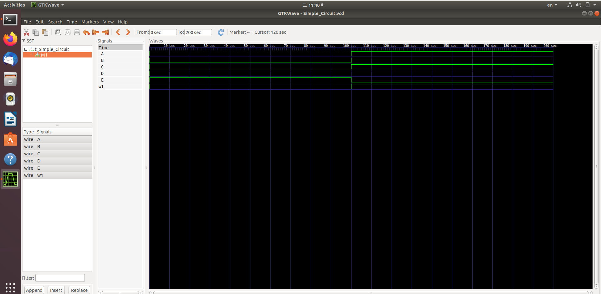

# Lab0 - Environment setting

## Download Verilog and GTKWave
```sh
apt install verilog gtkwave
```

## Verify your installation

### Compile
```sh
make
# iverilog -o add_tb.vvp *.v
# vvp add_tb.vvp
```

### Show wave form
```sh
gtkwave add_tb.vcd
```
